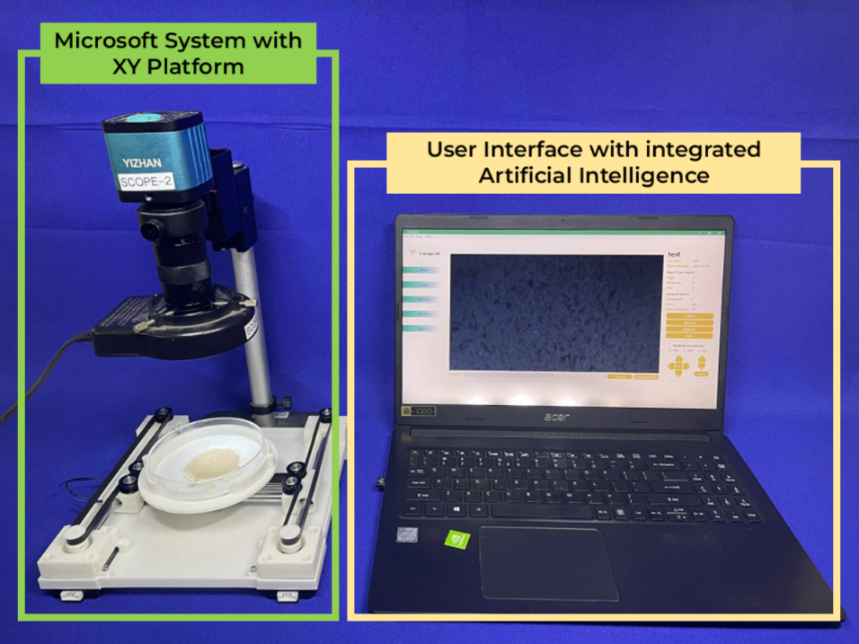
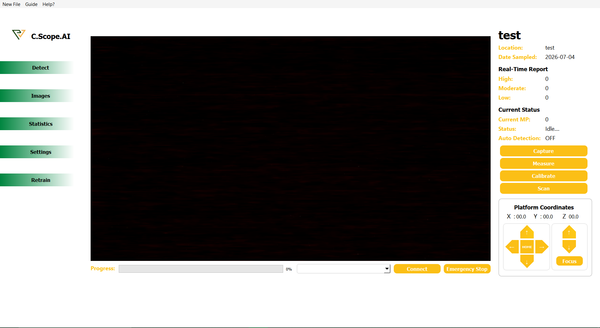

# PolyVision v2.0

> The core application software of **C.Scope.AI** — an automated imaging system for
> microplastics sample classification using convolutional neural networks.

## What is C.Scope.AI?

Microplastics — plastic fragments smaller than 5 mm — have become a pervasive
environmental and health concern, turning up everywhere from ocean trenches to
mountain summits. Studying them means examining water and sediment samples under a
microscope and identifying particles by hand: slow, repetitive, and error-prone work.

**C.Scope.AI** automates this process. Developed by the Department of Computer
Engineering at the **University of San Carlos** in collaboration with the university's
Biology Department under the ASEAN *Southeast Asia Program on Microplastics*
(SEA-MaP), it replaces manual microscopy with an automated imaging pipeline that:

- moves the petri dish beneath the microscope on an **automated XY platform**,
  eliminating the manual back-and-forth between microscope and camera;
- captures microscope imagery through an integrated camera and software workflow; and
- classifies microplastic samples using a **convolutional neural network (CNN)**.

The result significantly reduces the tedious, strenuous work faced by SEA-MaP
researchers and streamlines microplastic identification end to end.



*Figure 1. The overall C.Scope.AI system — the automated XY imaging platform,
microscope and camera, and the PolyVision software with integrated AI.*

The first iteration proved the concept, reaching **91% classification accuracy**, but
had clear limits: a costly, over-specialized XY platform that could not adapt to
existing microscopes; a fragmented software application weighed down by external
dependencies and difficult to set up without the development team; and a monolithic
model that could not learn from new data. **Version 2** redesigns the hardware and
software architecture to adapt to a wider range of microscopes, simplifies setup for
non-technical end users, and adds a **local retraining pipeline** so the model can be
improved on the user's own machine — broadening the system's reach beyond SEA-MaP
alone.

## PolyVision — the software

PolyVision is the software component of C.Scope.AI and the focus of this repository. It
is a Windows desktop application that unifies image capture, hardware control, model
inference, and retraining into a single package — the simplified, dependency-light
successor to the fragmented v1 software.



*Figure 2. The PolyVision v2.0 desktop application.*

It combines:

- The desktop application and workflow management
- GRBL-based control of the automated XY imaging platform
- A retrainable AI/ML pipeline for model inference and continuous learning

Key components:

- `PyQt5` for the graphical user interface
- `Detectron2` for object detection and inference
- `OpenCV`, `Pillow`, and custom UI modules for image capture, review, and export
- GRBL/Serial support for automated XY platform motion and measurement
- Retraining support for updating the AI model with new datasets

## Repository structure

```
.
├── ui/                  # main application code and GUI modules
├── models/              # training scripts, dataset tools, evaluation, experiments
│                        #   (incl. models/archive/ for earlier iterations)
├── tools/               # developer utilities (e.g. mark_base.py — stamp a base model)
├── tests/               # automated tests (e.g. GPU retraining runtime checks)
├── docs/                # packaging and GPU retraining guides
├── .github/             # CI workflows (e.g. PR description automation)
├── packaging/           # build and GPU-repair tooling
│   ├── build_exe.bat            # builds the standalone .exe via PyInstaller
│   ├── setup_build.bat          # build environment setup
│   ├── build_requirements.txt   # extra deps needed to build the .exe
│   ├── PolyVision.spec          # PyInstaller spec file
│   └── repair_gpu_env.bat/.py   # source-install GPU environment repair
└── requirements.txt     # Python dependencies for the application
```

> **Note:** `detectron2/` is not included in this repository. It must be cloned separately — see Installation.

## Prerequisites

- Windows 10 or 11
- Python 3.10.13 (64-bit)
- Git

## Installation

1. Install Python 3.10.13:
   https://www.python.org/downloads/windows/

2. Clone this repository.

3. Clone Detectron2:

   ```powershell
   cd .\PolyVision-v2.0\
   git clone https://github.com/facebookresearch/detectron2.git
   ```

4. Create and activate a virtual environment:

   ```powershell
   py -3.10 -m venv venv
   .\venv\Scripts\activate
   ```

5. Install the required Python packages:

   ```powershell
   pip install -r requirements.txt
   ```

6. Install Detectron2 in editable mode:

   ```powershell
   cd detectron2
   pip install -e .
   cd ..
   ```

## Model files and assets

Large files (model weights, datasets, evaluation outputs) are not included in this repository due to their size. The application resolves them automatically from the `models/` directory at runtime.

Download the four model folders from this Google Drive folder:

https://drive.google.com/drive/folders/1ZMB1I_3Cc35C7hiKsMExzhUH6xYldoSB?usp=drive_link

Place them directly inside `models/` so the layout looks like this:

```
models/
├── SEAMaP-Binary-Full/
├── SEAMaP-Binary-Full-6/
├── SEAMaP-Multi-class-100/
└── SEAMaP-Multi-class-100-1/
```

## Running the application

Start the main application from the `ui` directory:

```powershell
cd ui
python PolyVisionMain.py
```

## Advanced topics

These sections are not needed for normal use — they cover GPU diagnostics and the
developer workflow for stamping new base models.

### GPU retraining

When retraining starts, PolyVision checks for a usable NVIDIA CUDA stack (PyTorch,
Torchvision, and the Detectron2 native extension). If it validates, retraining and
the post-training benchmark run on the GPU; otherwise PolyVision falls back to CPU
when a valid CPU stack is available.

To check the runtime on a source/venv install, run this from the repository root:

```powershell
python ui\PolyVisionMain.py --diagnose-retraining --require-gpu
```

Note the `ui\` prefix — the diagnostic is launched from the repo root, unlike the
application itself, which is launched from inside the `ui` directory. Add `--json`
for machine-readable output.

The diagnostic only **reports** state — it never changes anything. Use the exit
code to decide what to do next:

| Code | Meaning | What to do next |
|------|---------|-----------------|
| `0`  | Requested runtime is ready — *either* fully GPU-ready, *or* the GPU runtime is correctly built but this machine's card has too little VRAM (under ~3.5 GB, status `gpu_insufficient_vram`) so it falls back to CPU | Proceed — safe to retrain or to package. A low-VRAM build machine still produces a GPU-enabled package; the CPU fallback is a per-machine runtime choice, not a property of the build. |
| `1`  | Retraining unavailable (even CPU is broken) | Repair the source install: [Repair a Source Installation](docs/GPU_BUILD_SETUP.md#repair-a-source-installation). |
| `2`  | Retraining works, but the `--require-gpu` GPU requirement is not met | **Running from source:** fine — use CPU (drop `--require-gpu`). **Packaging:** rebuild the GPU stack with [`repair_gpu_env.bat`](docs/GPU_BUILD_SETUP.md#repair-a-source-installation), since the build is GPU-only. See [Running from source vs. packaging](docs/PACKAGING_GUIDE.md#running-from-source-vs-packaging). |

#### GPU-ready pass criteria

This is the single source of truth for what "GPU-ready" means. A **fully
GPU-ready** runtime reports all of:

- `"status": "gpu_ready"`
- `"selected_device": "cuda"`
- `"retraining_available": true`
- `"cpu_ready": true`
- `"gpu_ready": true`
- `"detectron2_native_available": true`
- `"detectron2_cuda_available": true`

**Exit code `0` does not require all of these.** `--require-gpu` validates that
the GPU runtime is correctly built (CUDA present, Detectron2 compiled with CUDA,
versions matched) — *not* that the build machine is large enough to train. So a
build machine whose GPU has too little VRAM (under ~3.5 GB) reports
`"status": "gpu_insufficient_vram"`, `"selected_device": "cpu"`, and
`"gpu_ready": false`, yet still **exits `0`** and passes the build gate. The
packaged executable re-runs this diagnostic on each end-user's machine, so a
field GPU with enough VRAM is still selected for CUDA at runtime.

The packaging and user guides link here rather than restating these fields.

For packaged-user guidance, repairing a broken source install, and the GPU
packaging/distribution handoff, see the dedicated guides:

- [GPU Retraining User Guide](docs/GPU_RETRAINING_USER_GUIDE.md) — for packaged
  end-users: what to do when retraining shows a GPU message.
- [GPU Build & Repair Setup](docs/GPU_BUILD_SETUP.md) — for developers and
  administrators: installing the CUDA 11.8 / MSVC toolchain, running
  `repair_gpu_env.bat`, Detectron2 architecture coverage, and validating the
  runtime before packaging.
- [Packaging Guide](docs/PACKAGING_GUIDE.md) — the build and distribution flow
  and the packaged acceptance gate.

### Base model protection

The base model is the original, protected model that must never be deleted when a
retrained model is deployed. It is identified by a `base_model.marker` file inside
its folder — **not** by its folder name — so a newly trained base (which has a
different timestamp) is still recognized.

The base models downloaded above are recognized automatically (their original v1
folder names are kept as a built-in fallback), so **no action is needed for the
current models**.

When a developer trains a **new** base model, stamp its folder once before sharing
or bundling it, using the matching `--type`:

```powershell
# Binary base:
python tools/mark_base.py "models/SEAMaP-Binary-Full/faster_rcnn_R_50_FPN_3x/<timestamp>" --type Binary

# Multiclass base:
python tools/mark_base.py "models/SEAMaP-Multi-class-100/faster_rcnn_R_50_FPN_3x/<timestamp>" --type Multiclass
```

The marker lives inside the model folder, so it travels with it (e.g. over Google
Drive) and is bundled with the app. If no protected base can be identified,
deployment halts without deleting anything, as a safety measure.

## Notes

- This repository is dedicated to the PolyVision v2.0 software package only — the
  main software component of the C.Scope.AI automated imaging system.
- If you encounter issues, verify that Detectron2 is installed correctly and that
  the virtual environment is active.
